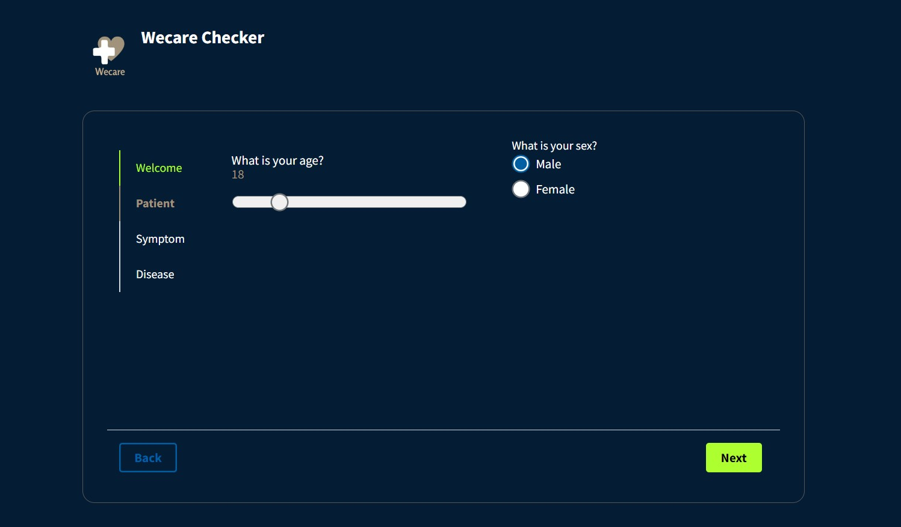
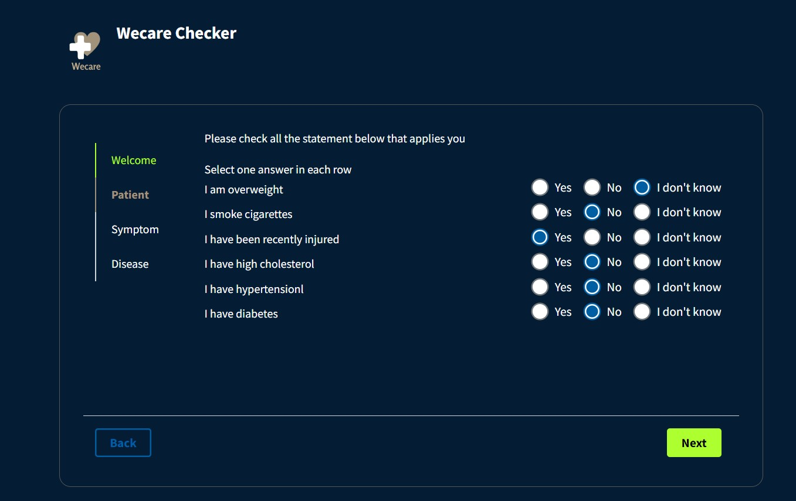
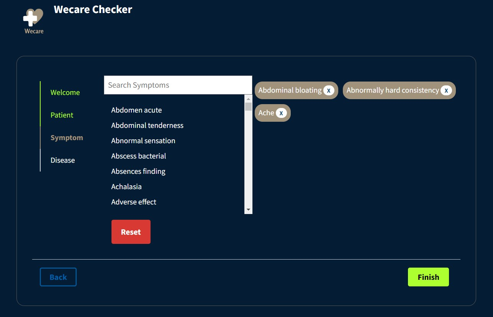
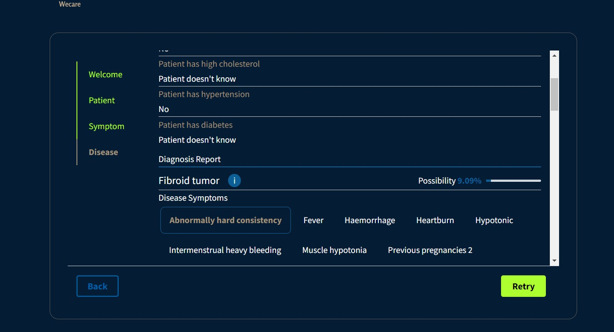

# WeCare Healthverse

  

  <h3 align="center">Wecare - The HealthVerse</h3>

  

    <a href="https://wecare32.vercel.app/" target="blank">Live Demo</a> 
  

---

## The motivation:
As per the Lancet [report](https://www.thelancet.com/journals/lancet/article/PIIS0140-6736(18)31668-4/fulltext) 1.6 million Indians died due to poor quality of care in 2016. And nearly twice as many as due to non-utilisation of healthcare services(838,000 persons) that why we visualized to make the healthcare system more mobile and easy available with 27*7 capabilities. 

<!--  -->
  
  
(<a href="#top">back to top</a>)

  
 ---

## How it works :

We have here modernized our healthcare system through  WeCare Fun Bot , WeCare Checker , Scheduling Appointments with Doctors and Doctor Login System .The fun bot is used to tell jokes to uplift our mood through jokes , Jokes helps one to cope mental pressure and lighten our mood. Here we are prediciting one's possiblity to have a certain Disease. Here we are using our model's API to predict the possibility to have the particular disease based  on specific chosen symtoms. Finally we are also allowing users to book online appointment for check up. 

(<a href="#top">back to top</a>)

---

## Technologies Used :

1. **Frontend frameworks** : `React` ,  `SASS` , `react-router-dom` , `react-toastify` ,  `react-helmet`

2. **Authenciation**       : `Firebase`

3. **Database and storage**: `Firestore`

4. **Services**            : `Azure` , `JOKE API` , `Postman` , `Kaggle` , `Vercel` 

5. **Deployment**          : `Docker` , `FastAPI`

6. **ML Frameworks**       : `Numpy` , `Pandas` , `Tensorflow` , `Sklearn` , `nltk` 

## Let's do a walkthrough of my app

## **Welcome Your Web app**

## Here we have our Joke bot ! Joke_bot helps you to get rid of the stress troubling you

## Fill out the details as such your gender and age

## Fill in all necessary information to track  your previous history of illness

## Now Fill in the Symtopms you likely have

## Hurray ! We got the results

**Here we see we have got a diagonis report and possibility of having the disease based on the patients track record of previous illness along with the other symtoms of that disease**

*Add_in : You can also learn about the disease directly by clicking on info*

## Doctor's call is final, So do check yourself up with doctor!!

### Deskstop View

### Mobile View of Doctor's Dashboard

(<a href="#top">back to top</a>)

---

  
 
  

<!-- ACKNOWLEDGMENTS -->
## Acknowledgments

Use this space to list resources you find helpful and would like to give credit to. I've included a few of my favorites to kick things off!

* [GitHub Emoji Cheat Sheet](https://www.webpagefx.com/tools/emoji-cheat-sheet)
* [Alan Ai](https://alan.app/)
* [Favicon Converter](https://favicon.io/favicon-converter/)
* [Img Shields](https://shields.io)
* [GitHub Pages](https://pages.github.com)
* [Font Awesome](https://fontawesome.com)
* [React Icons](https://react-icons.github.io/react-icons/search)

(<a href="#top">back to top</a>)

